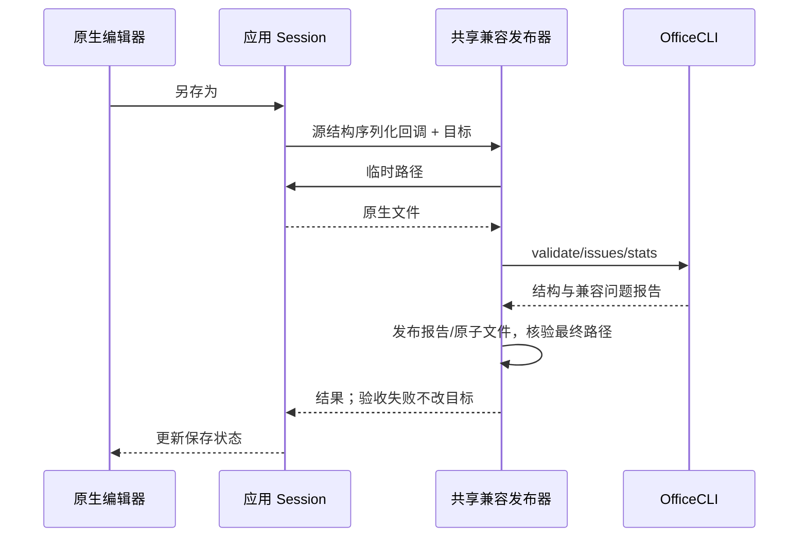

# 原生可编辑兼容保存

## 产品规则

PPT/DOCX/XLSX 的可编辑兼容保存使用当前源结构序列化器，不经过整页图片，不从渲染像素恢复文档。保留原生文字、run、表格、图形、图表及现有媒体/未知 OOXML 部件；OfficeCLI 作为独立校验层，不重建原生包。三种格式“另存为”共用同一验收发布器，菜单增加“另存可编辑兼容版”。普通保存、恢复副本和整页图片保真导出保持独立。

每次：生成临时原生文件 → OfficeCLI validate/issues/stats → 写兼容报告 → 原子发布 → 验证最终落盘。validate 失败不覆盖目标。issues 非零如实保留，不能视为布局通过。不能嵌入透明整页覆盖层掩盖文本。

## 所有者

应用各自 session 仍为内容唯一所有者；packages/electron-utils 的 publishCompatibleOffice 唯一负责临时导出验收与发布，调用应用提供的序列化函数。OfficeCLI 运行时解析必须注入 app 路径/资源路径/打包标志，不依赖 Electron 全局或另一个应用实现。

## 分层与视觉验收边界

原始 OOXML 有原生表达的复杂对象保留原结构，而非擅自替换。仅在映射失败且存在可信局部渲染时允许按对象粒度栅格化，保留 z-order、EMU box、透明度与上层可编辑文本。不得将源预览中的 Unsupported 占位符当作可信局部图。

OfficeCLI 的 issues 不是像素对照。目前发布器报告 layoutVerification=not-run，不能声称完成 SSIM/MSE 闭环。下一层独立 LibreOffice/PowerPoint 渲染与源图差异检查必须成功取得两种图后才可改变对象；禁止仅按类型盲目栅格化。报告必须区分结构通过、兼容警告、视觉未验收。

## 验收

- PPT 文本/形状保持原生且 EMU 不变；DOCX 段落表格保持；XLSX 公式/命名/打印信息保持。
- 验收器只读源包；输出与原生序列化结果字节一致，失败不覆盖旧输出。
- OfficeCLI 真实三种格式验收；单测覆盖失败、缺工具、问题报告与原子发布。
- 源码类型检查/Lint；修改文档应用与 shell 构建。

## PPT 自动混合闭环（实现范围与验收边界）

新增独立导出命令，不复用另存为改变会话路径。Main 先序列化并重新打开原生快照，将 bytes、RenderSlides 和可回退对象索引/原 XML 哈希交给 renderer；renderer 只渲染此快照。用户继续编辑不会改变本次导出。Main 不建立第二份编辑会话。导出内容以快照为准，不消费后续编辑。

只允许原 XML 不含文字/表格/图表/嵌入媒体、同时有自定义几何/复杂效果的对象参与回退；简单文本/图形/表格/图表保持原生。未知占位符不能作为可信原图。Renderer 对候选对象在透明整页画布中单独渲染；Main 按源页 EMU 尺寸放置透明对象图，保留所有其他对象及源 z-order，不按字形像素重建文本框。

序列化原生快照 → LibreOffice→PDF→Poppler PNG 与源渲染逐页64px分块 MSE 比对 → 仅对有差异页上的候选复杂图形作透明对象图片替换 → 重新独立渲染 → 仅接受该页误差实际降低的替换，回滚没有改善的页 → 再验证最终文件。总计最多三次视觉审计。无法取得独立渲染器时只导出原生结构，报告 unavailable，不能宣称视觉通过。文字差异与未支持区域保留为 review-required。

UI 显示快照、参考图与独立审计阶段；报告包括最终 diff、尝试与接受/回滚的对象数。逐页审计进度推送尚未实现。最终校验通过且磁盘核验后显示目标文件，并在文件管理器定位。

Word/Excel 禁止将段落/单元格转图。原生内容与打印信息仍由各自序列化器保留；OfficeCLI 的结构/公式/字段问题进入报告，未经独立版面对照仍为 not-run。视觉审计工具可以对这两种文档与其源分页 PNG 独立验收，不把 OfficeCLI 自身渲染当作源图。

## 生成包的备注母版顺序修复

已复现当前 PptxGenJS 输出将 `notesMasterIdLst` 放在 `sldIdLst` 后，违反 presentation 子元素顺序。HTML 生成器拥有生成包修正：只移动备注母版列表到幻灯片/尺寸列表之前，原备注关系及内容保持；不修改用户打开的原生包、不放宽 OfficeCLI 校验。验收覆盖实际生成 XML 顺序和端到端兼容导出。

## 两种高保真导出入口

菜单与 File 面板均提供独立的“高保真 PPTX（整页图片）”及“高保真 PPTX（可编辑）”。保存对话框标题、默认文件后缀与完成提示也区分两类。图片版每页一张图；可编辑版使用源结构快照，原生文字/表格/基础图形保持可编辑，复杂纯图形仅按视觉审计结果局部栅格化。布局未通过时不能显示“高保真验收通过”。不改变普通另存为。Renderer 只发导出命令，Main 与共享发布器仍为磁盘发布所有者。

验收：桌面原生菜单两个入口存在且独立；File 面板两按钮分别派发对应导出；可编辑导出 E2E 保持原生文字，图片版既有落盘测试通过。

历史生成稿也可能含旧版 PptxGenJS 的错误节点顺序。可编辑导出在独立快照上修正这一明确的 schema 缺陷，保留文字、对象、关系与用户原稿；不得直接修改源会话或原稿文件。生成器与导出共用同一个包准备函数，不重复编写 XML 移动规则。
