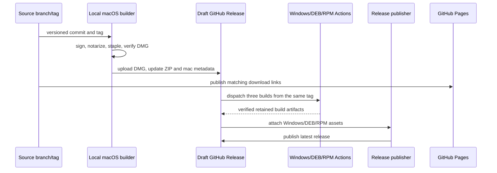

# Multi-platform release and local DMG retention

## Product rules

- One source version identifies the macOS, Windows, DEB, and RPM artifacts.
- The macOS ARM64 DMG must be signed with Developer ID, notarized, stapled, and verified with Gatekeeper before release publication.
- Windows, Ubuntu DEB, and Rocky Linux RPM are built on GitHub Actions native runners from the same release tag. The release stays draft until all platform artifacts pass verification and are attached.
- Landing Page and README download buttons point to that release's exact artifact names. The landing page version label changes with the installer links.
- Keep exactly the latest verified DMG in the local `apps/shell/release` folder. GitHub retains the update ZIP and platform artifacts required by downloads/updater.
- Notary credentials live in macOS Keychain. Never save the app-specific password in source, environment files, logs, or GitHub artifacts.

## State owners and sequence

## Acceptance

- `codesign --verify --deep --strict`, `spctl --assess --type open`, and `stapler validate` pass for the generated DMG.
- Notary submission status is `Accepted`.
- Before publishing a macOS release, run the OfficeCLI packaged-runtime check against the signed app resources to ensure the Developer ID signature remains acceptable after packaging.
- Windows installer, DEB, and RPM workflows succeed and upload artifacts for the same tag.
- Latest release contains one version of every requested installer; download links return HTTP success.
- Landing Page links use the same version and filenames.
- Local `apps/shell/release` contains only the verified latest DMG after publication.
