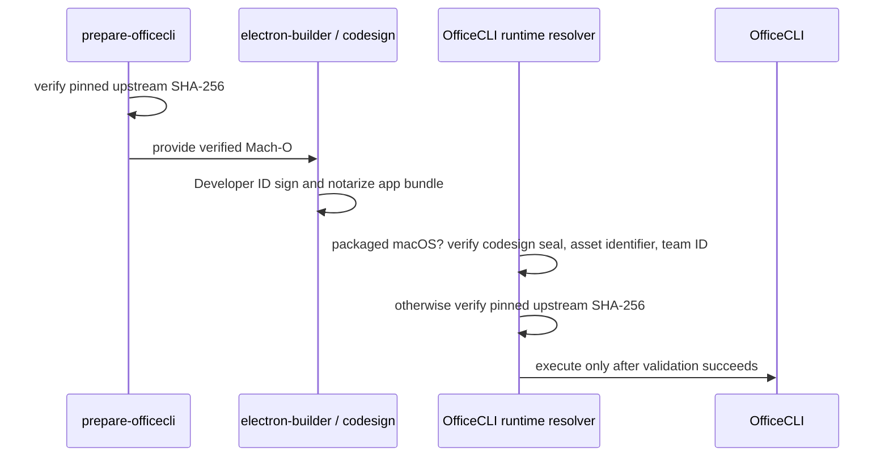

# Packaged OfficeCLI signature validation

## Product rules

- OfficeCLI downloads are verified against the pinned upstream SHA-256 before packaging or execution.
- macOS release packaging re-signs the bundled Mach-O executable with the app's Developer ID certificate. Since code signing changes the file bytes, a packaged macOS OfficeCLI is validated by its code signature instead of the upstream raw-file hash.
- A packaged macOS OfficeCLI is accepted only when `codesign --verify --strict` succeeds and its signature metadata has the expected asset identifier and ZenOffice Developer Team ID (`5N66S29EK2`).
- Unpackaged binaries and packaged Windows/Linux binaries continue to require their pinned upstream SHA-256.
- Missing, malformed, unsigned, or differently signed packaged macOS binaries fail closed with a useful error.

## State owner and validation flow

`packages/electron-utils/src/officecli-runtime.ts` owns runtime executable resolution and validation. Build-time acquisition remains owned by `tools/prepare-officecli.mjs`; `apps/shell/electron-builder.cjs` verifies the original upstream bytes before packaging. macOS signing then changes the packaged executable, so the runtime selects validation based on packaged state and platform:

## Acceptance scenarios

- A packaged macOS binary with the expected Developer ID team, asset identifier, and intact signature resolves successfully even though its bytes differ from the upstream hash.
- A packaged macOS binary with a broken signature, wrong team ID, wrong identifier, or missing file is rejected.
- A packaged non-macOS binary with a checksum mismatch remains rejected.
- An unpackaged binary continues to require the pinned upstream SHA-256.
- A macOS release build confirms the bundled OfficeCLI has the expected team signature and a real editable Office export can invoke it.
- The release acceptance runs the macOS integration test against the actual packaged app resources, not only a mocked signature metadata string.
- CI prepares the pinned Linux OfficeCLI in the workspace before running OfficeCLI integration tests; those tests must not depend on runner user-directory caches.
- Linux CI installs the .NET 10 runtime required by the framework-dependent OfficeCLI before unit/integration and Electron E2E tests.
- Playwright E2E callbacks use its supported fixture destructuring signature so test discovery works consistently in CI.
